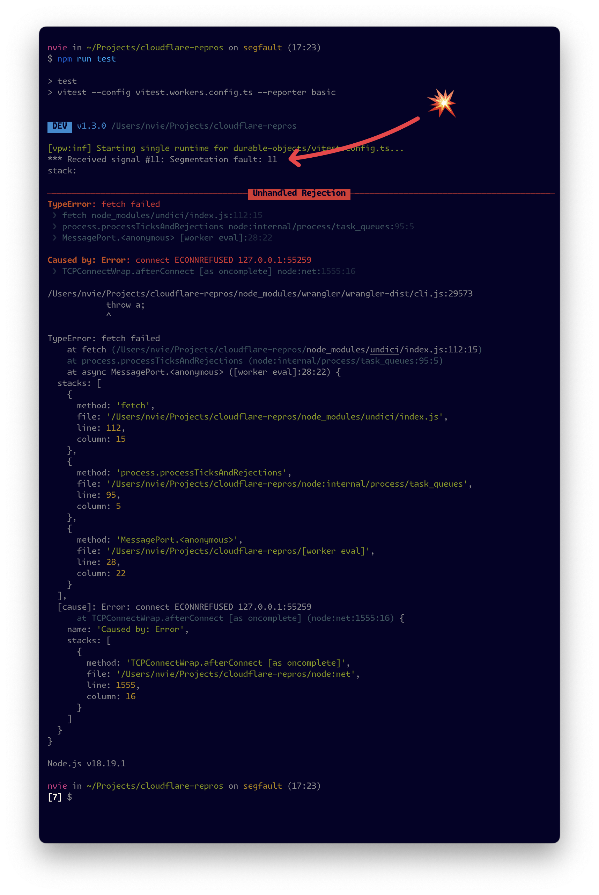

# The replication

This repo demonstrates a bug where websocket hibernation causes a segfault.

1. Check out this branch.
2. `npm i`
3. `npm run test` (takes 10 seconds due to the wait)
4. 💥 Crash with segfault 💥

# The crash details

[Crash logs here.](https://gist.github.com/nvie/dbab48f38200a15947053d451eb62730)

